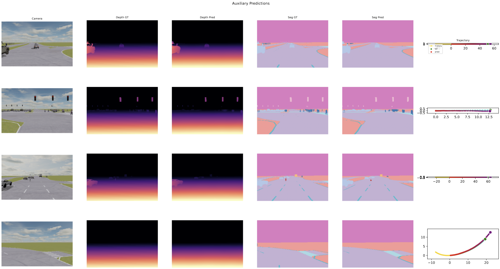

# Guido — End-to-End Trajectory Prediction for Autonomous Driving

An end-to-end neural trajectory planner that predicts 60 future waypoints from
a single front-facing camera image, ego-motion history, and a high-level
driving command. Trained and evaluated on a subset of the
[nuPlan](https://www.nuplan.org/) dataset.

**Phase 1 result: 1st place**, val ADE ≈ 1.53 m over a 6-second horizon.  
**Phase 2 result: 2nd place**, val ADE ≈ 1.48 m with auxiliary depth + segmentation tasks.  
**Phase 3 result: 1st place**, test ADE ≈ 0.98 m — sim-to-real generalisation on real driving data.

---

## Architecture

### Phase 1 — DrivingPlannerV3

```
Camera (3×256×256)  →  DINOv3 ViT-B/16  →  CLS token + 256 patch tokens
                        (last block unfrozen)

History (21 steps)  →  Transformer encoder  →  history tokens + summary
Command             →  (dropped — all samples are 'forward')

Scene-motion grounding:
  history tokens attend over patch tokens  →  2D RoPE cross-attention

Context token:  linear proj of [img_cls | hist_cls]

Coarse head (MLP):  anchor waypoints  +  auxiliary MSE loss
Fine head (Transformer decoder, 2–3L):  60-step trajectory
```

### Phase 2 — DrivingPlannerV4

Same trajectory architecture, plus auxiliary perception heads trained jointly:

```
DINOv3 backbone (2 blocks unfrozen)
  │
  ├─→ trajectory pipeline (unchanged from V3)
  │
  └─→ patch tokens from 4 intermediate blocks (via forward hooks)
        └─→ DPT-light decoder (feature pyramid, d=256)
              ├─→ DepthHead    → (B, 1, H, W)  SILog loss
              ├─→ SegHead      → (B, 14, H, W) cross-entropy
              └─→ normals      → derived from depth gradients, free labels

Images resized to 192×304 (nearest multiples of 16 to 200×300 native),
giving a 12×19 patch grid that preserves the original aspect ratio.
```

---

## Results

| Model | Val ADE | Notes |
|---|---|---|
| V1 baseline (ViT-S, GRU, MLP decoder) | 1.96 | Course baseline |
| V1 + ViT-B backbone | 1.90 | |
| V2 (Transformer history encoder) | 1.57 | |
| V2 large + coarse-to-fine | 1.54 | |
| V3 (2D RoPE, best Phase 1) | **1.53** | 1st place Phase 1 |
| V4 + aux tasks (Phase 2) | **1.48** | 2nd place Phase 2 |
| V5 + real data fine-tune (Phase 3) | **0.98** | **1st place Phase 3** |

---

## Qualitative results (Phase 2)



*Left to right: camera input, GT depth, predicted depth, GT segmentation,
predicted segmentation, trajectory (gold = history, green→teal = GT, red→purple = predicted).*

Depth and segmentation are predicted accurately. The trajectory decoder handles
most scenarios well; far-horizon prediction (t > 3s) remains the primary
source of error.

---

## Installation

```bash
git clone https://github.com/<you>/guido
cd guido
uv sync
```

**DINOv3 weights**: request access from Meta via the
[DINOv2 model card](https://github.com/facebookresearch/dinov2).
Download `dinov3_vitb16_pretrain_lvd1689m-73cec8be.pth` and set
`dino_repo_dir` / `dino_weights` in your config.

**Dataset**: a 2.6 GB subset of nuPlan (5k train / 1k val / 1k test).
Kaggle competition: [dlav-trajectory-prediction](https://www.kaggle.com/competitions/dlav-trajectory-prediction-phase1).
For broader experiments the full [nuPlan dataset](https://www.nuplan.org/)
can be used with minor changes to `dataset.py`.

**Hardware**: single V100 (32 GB), 2–4 hours per training run.

**Logging**: [Weights & Biases](https://wandb.ai) — set `wandb_entity` in
your config or pass `--no-wandb` to disable.

---

## Usage

```bash
# Train (Phase 1)
uv run src/train_v3.py --config configs/V3/baseline.yaml

# Train (Phase 2, with aux tasks)
uv run src/train_v4.py --config configs/V4/phase2.yaml

# Train (Phase 3, sim-to-real fine-tune on mixed data)
uv run src/train_v5.py --config configs/V5/phase3.yaml

# Validate (Phase 2)
uv run src/predict_v4.py --checkpoint checkpoints/best.pth --split val

# Validate (Phase 3, real val set)
uv run src/predict_v5.py --checkpoint checkpoints/best.pth --split val

# Generate Kaggle submission (Phase 3 real test)
uv run src/predict_v5.py --checkpoint checkpoints/best.pth --split test \
    --output submission.csv

# Test-time augmentation (mirror flip + average)
uv run src/predict_v4.py --checkpoint checkpoints/best.pth --split test \
    --tta --output submission_tta.csv

# Visualise predictions (trajectory + depth + segmentation)
uv run src/predict_v4.py --checkpoint checkpoints/best.pth --split val \
    --visualize --vis-output predictions.pdf
```

For SLURM clusters, see `scripts/submit_train.sh`.

---

## Experiments

### Phase 1 — V1 baseline

Frozen DINOv3 ViT-S CLS token → GRU history encoder → concat fusion → MLP decoder.
Best: ADE 1.96.

Ablations explored: ViT-B backbone (✓), data augmentation (✗ aggressive hurt),
wider dims (✗ overfit on 5k), cross-attention fusion (marginal), transformer decoder
(marginal at this scale).

Bugs fixed during this phase that invalidated earlier experiments:
- **Huber delta**: `delta=0.1` accidentally left active for absolute-position targets, flattening gradients above 10 cm. Restoring `delta=1.0` recovered ~0.2 ADE.
- **`torch.no_grad()` unfreeze bug**: backbone wrapped unconditionally, silencing gradients through supposedly unfrozen blocks.
- **Kaiming init on transformer attention**: applying gain=√2 to Q/K/V projections caused attention saturation at d≥384. Fixed by leaving PyTorch defaults on attention internals.

### Phase 1 — V2 architecture

Transformer history encoder, scene-motion cross-attention, coarse MLP auxiliary head.
Best single-head: ADE 1.54.

Explored K=3..6 mixture heads with winner-takes-all training. Oracle best-of-K
ADE reached ~1.0–1.2 with K=6, showing real specialisation. A trained router
closed the gap to ~1.65–1.7 at inference — the 5k dataset was insufficient to
jointly train specialised heads and a quality router.

### Phase 1 — V3 additions

2D RoPE on patch cross-attention (matched DINOv3's internal scheme), velocity
prediction (reverted — cumsum accumulation hurt static scenarios), causal decoder
(marginal), speed conditioning (marginal). Best: ADE 1.53, 1st place.

### Phase 2 — V4 auxiliary tasks

The Phase 2 constraint allows auxiliary perception supervision. The hypothesis
was that forcing the backbone to simultaneously support depth estimation and
semantic segmentation would produce richer patch token representations, reducing
the data ceiling on trajectory prediction.

**Data**: images are 200×300 natively. Previous phases resized to 256×256
(square), distorting the aspect ratio by 28% vertically. Phase 2 resizes to
192×304 — the nearest multiples of 16 — preserving geometry for the perception
heads and giving a 12×19 = 228-token patch grid.

**Aux decoder**: a DPT-light feature pyramid reads patch tokens from 4
intermediate backbone blocks (at ~25%, 50%, 75%, 100% depth). These are
reassembled at different scales, fused coarse-to-fine via residual blocks, and
passed to task-specific heads. `d_dec=256` gave noticeably sharper predictions
than the initial 128.

**Tasks**:
- *Depth* (SILog loss): raw uint8 values decode as `(255 - raw)/255 * 100m`.
  Depth predictions converged to visually accurate estimates within ~50 epochs.
- *Segmentation* (cross-entropy, 14 classes): learned well, though the dataset
  has a heavy class imbalance toward road/sky.
- *Surface normals* (free labels from depth gradients, L1 loss): encodes road
  geometry directly — flat road → upward normals, obstacles → tilted — providing
  a complementary geometric signal to raw depth values.

**Aux loss ramp**: lambda values ramped from 0 over 10–20 warmup epochs so the
trajectory branch could stabilise before receiving aux gradient. Without this
ramp the seg loss (many more pixel-level terms per image than trajectory terms)
dominated early gradient and hurt trajectory convergence.

**Causal decoder**: the standard transformer decoder self-attention lets query
t=59 directly attend to query t=1, which means far-horizon queries can implicitly
copy near-horizon estimates. Making self-attention causally masked forces each
query to be consistent with prior queries in a temporal direction. This gave a
modest improvement on `val/ade_far` (~3.1 → ~2.9) but results are inconclusive
at this data scale.

**Conclusion**: aux tasks trained well and improved trajectory ADE from 1.53
to ~1.48 (~4% gain). However, the improvement is modest relative to the
added complexity. The depth/seg heads appear to primarily regularise the
backbone rather than teach it fundamentally new spatial reasoning — the
representations were already strong from DINOv3 pretraining. The real ceiling
is the 5k training set, single forward camera, and absence of map information.
Future phases introducing BEV representations or larger datasets would be the
natural next step.

Best Phase 2 config: `configs/V4/p2-uf2-xattn_fuse-nocmd+.yaml` (val ADE ~1.48–1.49 cold-start; ~1.48 after fine-tuning from best checkpoint).

---

## Repository layout

```
src/
  train.py / predict.py          V1
  train_v3.py / predict_v3.py    V3 (Phase 1 best)
  train_v4.py / predict_v4.py    V4 (Phase 2)
  train_v5.py / predict_v5.py    V5 (Phase 3)     ← use these for real-world
  guido/
    dataset.py    DrivingDataset, augmentation (192×304 native resize)
    model_v3.py   DrivingPlannerV3 (2D RoPE, coarse head)
    model_v4.py   DrivingPlannerV4 (+ aux hook registration, causal decoder)
    aux_heads.py  AuxDecoder (DPT-light), DepthHead, SegHead, visualize_aux
    losses_v2.py  WTA loss, coarse auxiliary, smoothness, FDE variants
    utils.py      Checkpointing (includes aux head state), submission CSV

configs/
  V3/baseline.yaml    Phase 1 best               ← start here for Phase 1
  V4/phase2.yaml      Phase 2 best               ← start here for Phase 2
  V5/phase3.yaml      Phase 3 best               ← start here for Phase 3
  V1/ V2/ V3/ V4/ V5/ Full ablation history

notebooks/
  explore_phase2_data.py   Data exploration script for Phase 2 dataset
```

---


### Phase 3 — V5 sim-to-real generalisation

Phase 3 evaluates on a held-out real-world driving dataset. The training set
remains the same 5k synthetic nuPlan samples from Phases 1–2; a 1k-sample
real-world validation set (`val_real/`) is provided for adaptation, and
the test set is 864 real-world samples.

**Key finding from data exploration**: both synthetic and real data use the same
ego-relative coordinate system (current position always at origin, x = forward,
y = lateral). No coordinate normalisation was needed between domains — the domain
gap is purely visual (lighting, texture, weather, camera noise).

**Strategy**: warm-start from the Phase 2 best checkpoint (val ADE 1.48) and
fine-tune on a mixture of all 5k synthetic samples and 95% of the 1k real samples.
The Phase 2 checkpoint already knows the trajectory task structure; the fine-tuning
teaches it to read real camera imagery.

**What worked**:
- Warm-start from Phase 2 (critical — scratch runs converge to the same floor but slower)
- Using 950/1000 real samples for training, only 50 for local validation
- Stronger augmentation: `mirror_p=0.4`, `GaussianBlur`, `ColorJitter` with wider ranges
- Higher backbone LR than Phase 2 fine-tuning (`backbone_lr=7e-5`) to let DINOv3 features adapt to real imagery
- The test distribution turned out to be more favourable than val (test ADE ~0.75× val ADE)

**Result**: val ADE ~1.26, test ADE **0.98** — 1st place on the Phase 3 leaderboard.

**Further improvements not yet explored**:
- *Multi-seed ensembling*: training 3 models with different seeds and averaging
  predictions. With only 1k real samples, variance is high and ensembling should
  give ~0.05–0.10 ADE improvement for free.
- *Test-time augmentation*: mirror-flip + average at inference (already implemented
  in `predict_v5.py --tta`).
- *Progressive unfreezing*: start with backbone frozen, unfreeze blocks gradually
  as real-domain loss stabilises — would reduce forgetting of synthetic knowledge.
- *Real-data oversampling*: weighting real samples 2–3× higher than synthetic in
  the mixed batch, since test distribution is real-only.

Best config: `configs/V5/phase3.yaml`.

## Reference papers

Papers consulted (see `docs/`):
- TransFuser (Prakash et al., 2021) — transformer sensor fusion for AD
- UniAD (Hu et al., 2022) — unified autonomous driving
- VAD (Jiang et al., 2023) — vectorised scene representation